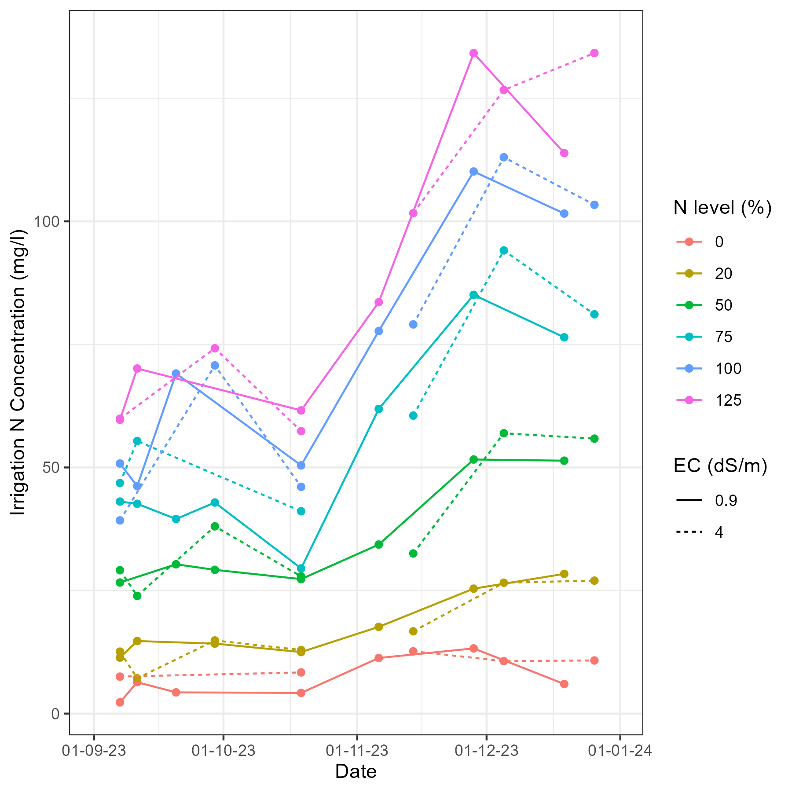
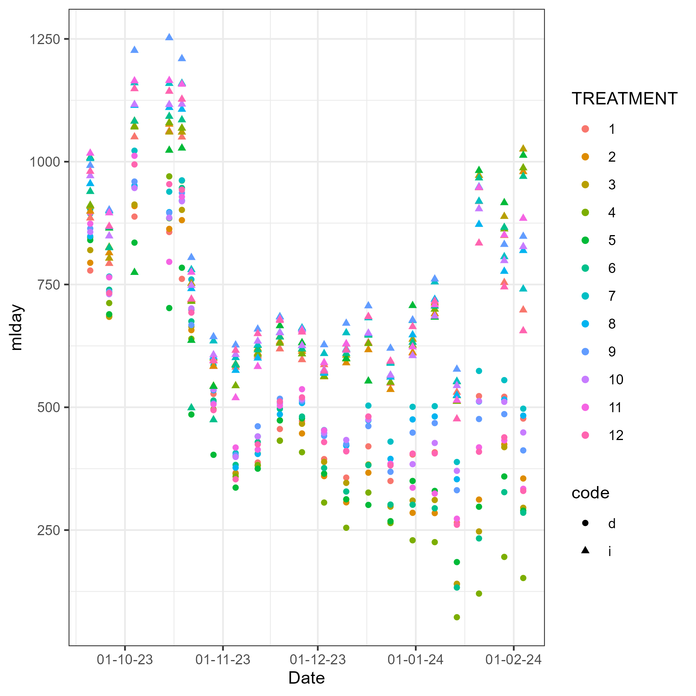
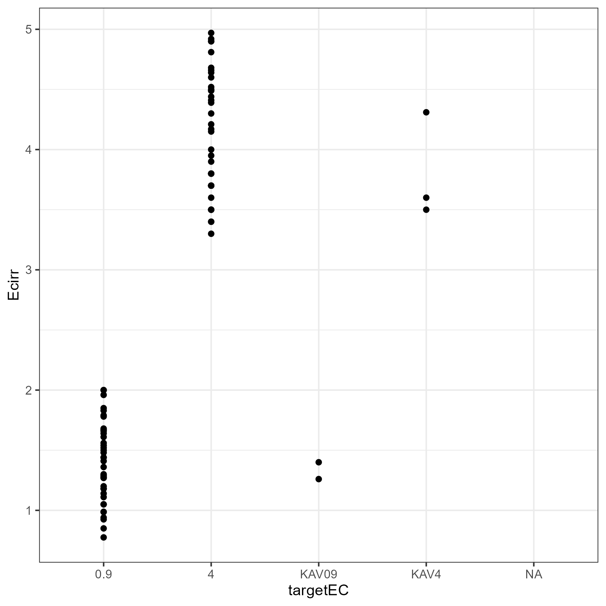
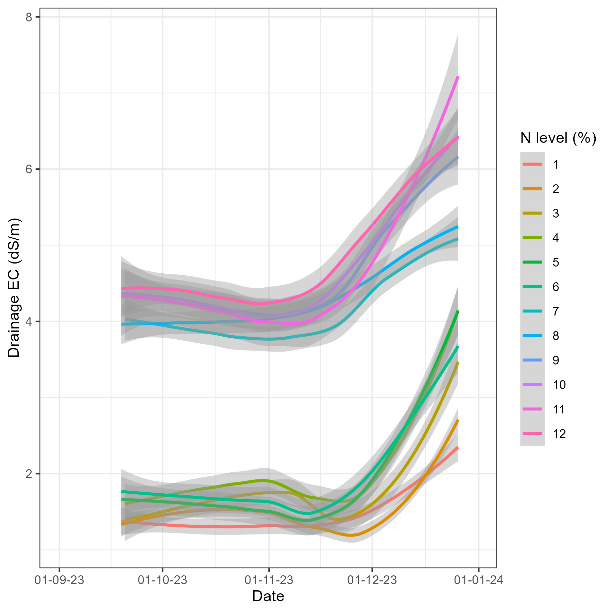
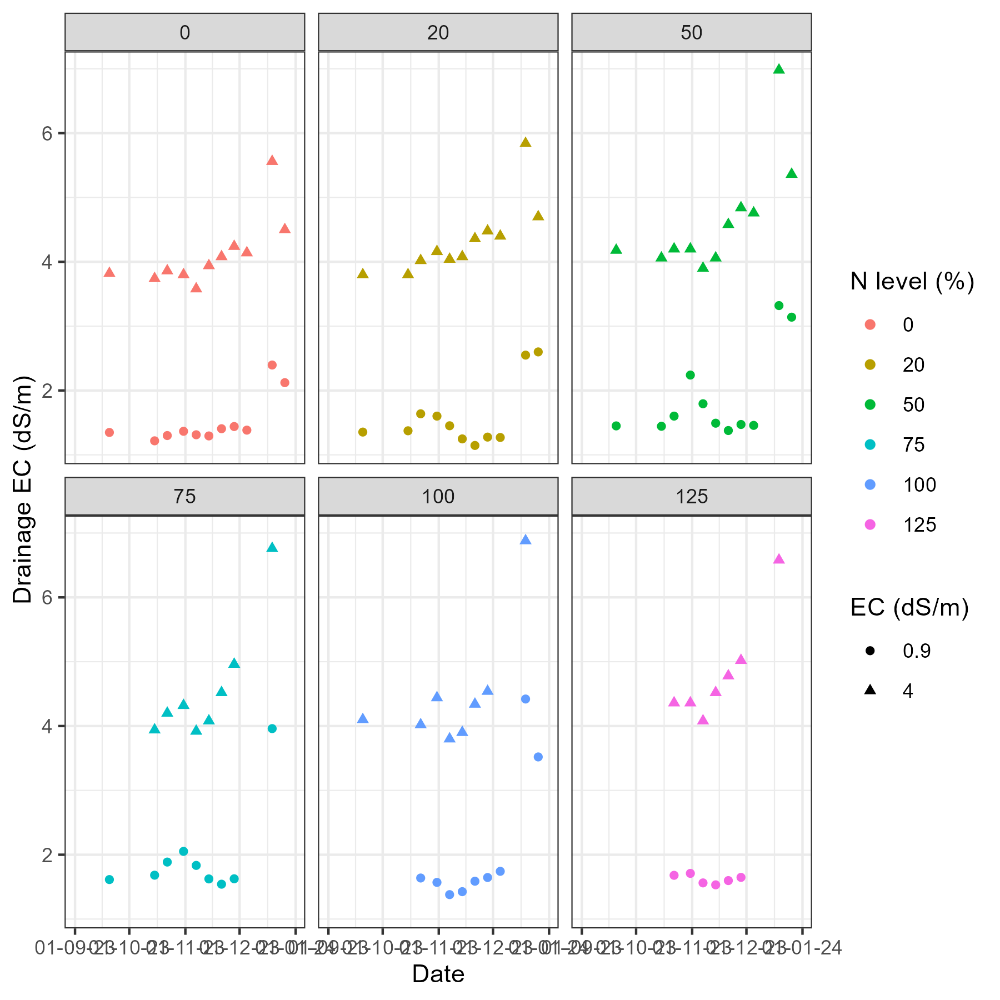
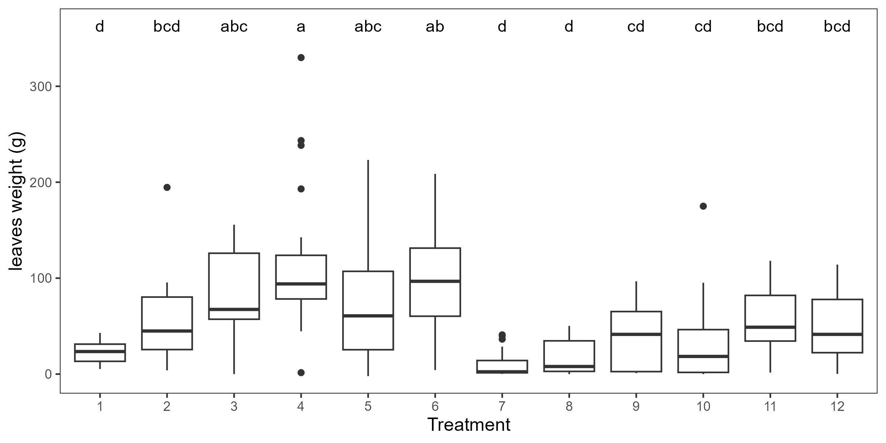
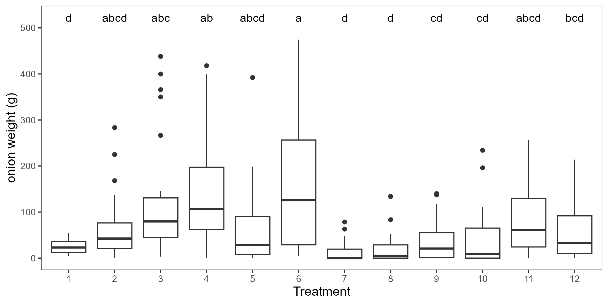
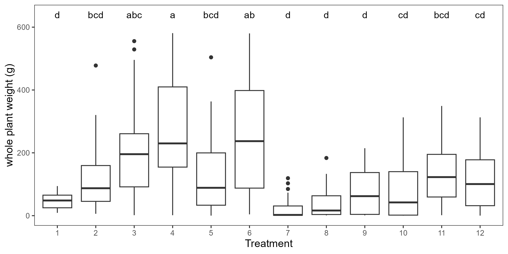

```{r setup, include=FALSE}
knitr::opts_chunk$set(echo = FALSE)
```

# Introduction


## Objectives


# Methods


# Results


## Nitrogen 

```{r nitr-irr, out.width='50%', fig.cap='Nitrogen irrigation', fig.align='center'}


```

```{r nitr-dra, out.width='50%', fig.cap='Nitrogen drainage', fig.align='center'}


```

## Electrical conductivity

```{r ec-irr, out.width='50%', fig.cap='Electrical Conductivity irrigation', fig.align='center'}


```


```{r ec-dra, out.width='50%', fig.cap='Electrical Conductivity drainage', fig.align='center'}


```

```{r ec-dra-nlev, out.width='50%', fig.cap='Electrical Conductivity drainage by N level', fig.align='center'}


```

## Weight

```{r lw, out.width='50%', fig.cap='Leaves Weight', fig.align='center'}


```

```{r ow, out.width='50%', fig.cap='Onions Weight', fig.align='center'}


```

```{r wpw, out.width='50%', fig.cap='Whole Plant Weight', fig.align='center'}


```

# Next Steps


# Conclusion

Try `posterdown` out! Hopefully you like it!

```{r, include=FALSE}
knitr::write_bib(c('knitr','rmarkdown','posterdown','pagedown'), 'packages.bib')
```

# References
